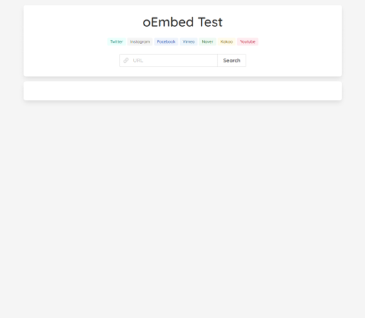
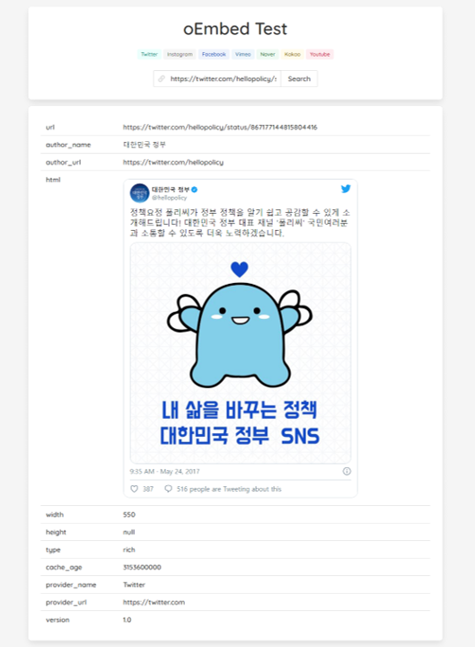

# 1. oEmbed 데이터 수집 웹 애플리케이션  
    * 개발 환경: Windows 10 64 bit, IntelliJ IDEA  
    * 기술 스택: Spring Framework(Boot), Mustache/jQuery  
```text
* oEmbed 서비스 (https://oembed.com)  
: URL을 통해 내장된 미디어 콘텐츠를 미리 볼 수 있도록 제공하는 API이다.  
: XML, JSON 포맷으로 데이터를 제공한다.
: 아래와 같은 방식으로 데이터를 요청할 수 있다.
  - {API}?url={URL}
  - https://www.youtube.com/oembed?url=https://www.youtube.com/watch?v=35EQXmHKZYs&format=json
```  

# 2. 패키지 구조  
```bash
*  
├── application  
│   ├── ApiCallService: API 호출 서비스 (WebClient)  
│   ├── DomainService: 도메인 서비스    
│   └── EmbedService: 도메인 조회 및 분기 처리  
│  
├── config   
│   └── WebClientConfig: WebClient 설정 및 로깅 필터  
│  
├── exception  
│   ├── GlobalExceptionHandler: 전역 예외 처리 핸들러  
│   └── CustomExceptions: 커스텀 예외 클래스  
│  
├── model  
│   ├── Domain: 도메인 모델 (name, endpoint)  
│   ├── DomainType: 도메인 타입 (facebook, instagram)    
│   └── ExceptionResponse: 예외 발생 시 응답 모델  
│  
└── web  
    ├── EmbedApiController: Ajax 호출을 받을 컨트롤러
    └── HomeController: 웹 화면 컨트롤러  
*  
├── static  
│   ├── home, tags: Ajax 호출 등 스크립트 (.js)  
│   └── home, tags: 스타일 시트 (.css)  
│  
├── templates  
│   └── home, header, footer, tags: 웹 페이지 (.mustache)  
│  
├── application.yml: 애플리케이션 설정 정보  
└── application-token.yml: 액세스 토큰 정보  
```  
# 3. 실행 확인  

`URL 입력 필드`에 조회할 URL 값을 입력한다.  
`URL 입력 필드`위의 `태그`를 클릭하면 샘플 값을 입력할 수 있다.  

`facebook`, `instagram`은 액세스 토큰을 요구하므로  
`application-token.yml`파일에 발급 받은 액세스 토큰을 입력한다.  
(https://developers.facebook.com/docs/facebook-login/access-tokens/refreshing?locale=ko_KR)

### [웹 화면] 기본 화면  
```
http://localhost:8000
```


### [웹 화면] oEmbed 데이터 수집 화면  
```
http://localhost:8000
```


